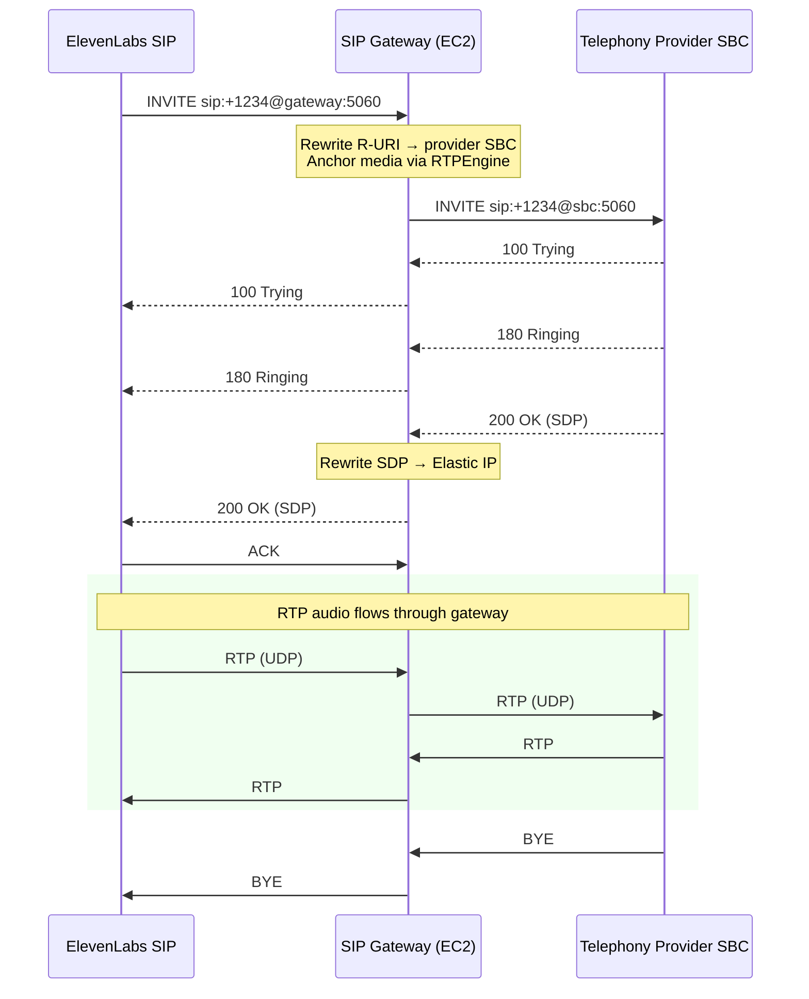

<p align="center">
  
</p>

<h1 align="center">ElevenLabs SIP Gateway for AWS</h1>

<p align="center">
  Deploy a regional SIP gateway on AWS EC2 — static Elastic IP, in-country presence, full media anchoring.
</p>

<p align="center">
  <a href="#quick-start"></a>
  
  = 1.5" />
  = 24.0" />
  
  
</p>

---

## Problem


| Issue | Impact |
|-------|--------|
| ElevenLabs SIP server IPs are dynamic | Legacy SBCs can't whitelist them |
| SIP INVITE originates outside your country | Blocked by local telecom regulators |
| SBC requires an IP, not FQDN | Direct connection impossible |

## Solution


Deploy this lightweight gateway in **any AWS region**. It gives you a **fixed Elastic IP**, **in-country presence**, and **media anchoring** — all RTP audio flows through it.

---

## Quick Start

Three commands to go from zero to a running SIP gateway:

```bash
# 1. Create infrastructure
cd terraform
cp terraform.tfvars.example terraform.tfvars   # edit: region + key_name
terraform init && terraform apply

# 2. Deploy the SIP stack
cd ../scripts
./deploy.sh --customer-sbc <YOUR_SBC_IP> --key ~/.ssh/your-key.pem

# 3. Smoke test
./test-sip.sh <elastic-ip>
```

That's it. Your gateway is running. Point your ElevenLabs outbound trunk to the Elastic IP.

---

## How It Works



| Component | Role | Ports |
|-----------|------|-------|
| **Kamailio 5.8** | SIP signaling proxy — rewrites headers, relays calls | TCP/UDP 5060 |
| **RTPEngine** | Media relay — rewrites SDP, proxies all RTP/RTCP | UDP 10000–20000 |

**Outbound** (ElevenLabs → Telephony Provider SBC): Kamailio rewrites the R-URI to the provider's SBC address.

**Inbound** (Telephony Provider SBC → ElevenLabs): Gateway detects the source IP matches the SBC and routes the INVITE to ElevenLabs over TCP.

---

## Prerequisites

| Requirement | Details |
|-------------|---------|
| **AWS CLI** | Configured and authenticated (`aws sts get-caller-identity`) |
| **Terraform** | >= 1.5 ([install](https://developer.hashicorp.com/terraform/install)) |
| **EC2 Key Pair** | Create in AWS Console → EC2 → Key Pairs. Download the `.pem` file. |

> VPC and subnet are **auto-detected** from your default VPC. No manual lookup needed.

---

## Step 1 — Provision Infrastructure

```bash
cd terraform
cp terraform.tfvars.example terraform.tfvars
```

Edit `terraform.tfvars` — only **two values** required:

```hcl
region   = "ap-south-1"       # pick your AWS region
key_name = "my-key-pair"      # your EC2 key pair name
```

Run Terraform:

```bash
terraform init
terraform plan      # review what will be created
terraform apply     # type "yes" to confirm
```

**What gets created:**

| Resource | Details |
|----------|---------|
| EC2 instance | Ubuntu 24.04 LTS, Docker pre-installed |
| Elastic IP | **Static** — the telephony provider whitelists this on their SBC |
| Security group | SIP (TCP/UDP 5060), SIP TLS (5061), RTP (UDP 10000–20000), SSH (22) |

Save the `sip_gateway_elastic_ip` output — you'll need it next.

---

## Step 2 — Deploy the SIP Gateway

```bash
cd ../scripts
./deploy.sh \
    --customer-sbc <YOUR_SBC_IP_OR_FQDN> \
    --key ~/.ssh/your-key.pem \
    --region ap-south-1
```

The script will:

1. Find your EC2 instance by its Name tag
2. Wait for Docker to finish installing (handles fresh instances)
3. Upload the Docker stack (Kamailio + RTPEngine) via SCP
4. Write the `.env` configuration with the telephony provider's SBC address and the Elastic IP
5. Build and start the containers

### Deploy options

| Option | Default | Description |
|--------|---------|-------------|
| `--customer-sbc` | *(required)* | Telephony provider SBC IP or FQDN |
| `--key` | *(required)* | Path to SSH `.pem` key file |
| `--customer-sbc-port` | `5060` | Telephony provider SBC SIP port |
| `--auth-user` | *(empty)* | Digest auth username |
| `--auth-password` | *(empty)* | Digest auth password |
| `--region` | `ap-south-1` | AWS region |
| `--instance-name` | `sip-gateway` | Name tag for instance lookup |
| `--instance-id` | *(auto)* | EC2 instance ID (skip name lookup) |
| `--ssh-user` | `ubuntu` | SSH username |

**With auth enabled:**

```bash
./deploy.sh \
    --customer-sbc sbc.example.com \
    --key ~/.ssh/my-key.pem \
    --auth-user elevenlabs \
    --auth-password 'SecurePassword123'
```

---

## Step 3 — Configure ElevenLabs

In the [ElevenLabs dashboard](https://elevenlabs.io/app/conversational-ai) or via API, set the **outbound trunk**:

| Field | Value |
|-------|-------|
| **Address** | `<elastic-ip>` (from Terraform output) |
| **Transport** | TCP |
| **Auth username** | *(if you set `--auth-user`)* |
| **Auth password** | *(if you set `--auth-password`)* |

---

## Step 4 — Smoke Test

```bash
./scripts/test-sip.sh <elastic-ip>
```

A **200 OK** response means the SIP signaling layer is healthy and ready for calls.

---

## Operations

Replace `<elastic-ip>` and `<key>` with your values.

| Action | Command |
|--------|---------|
| **SSH in** | `ssh -i <key> ubuntu@<elastic-ip>` |
| **View logs** | `ssh -i <key> ubuntu@<elastic-ip> 'sudo docker logs -f sip-gateway-kamailio'` |
| **Container status** | `ssh -i <key> ubuntu@<elastic-ip> 'sudo docker compose -f /opt/sip-gateway/docker/docker-compose.yml ps'` |
| **Restart** | `ssh -i <key> ubuntu@<elastic-ip> 'sudo docker compose -f /opt/sip-gateway/docker/docker-compose.yml restart'` |
| **Stop** | `ssh -i <key> ubuntu@<elastic-ip> 'cd /opt/sip-gateway/docker && sudo docker compose --env-file .env down'` |
| **Start** | `ssh -i <key> ubuntu@<elastic-ip> 'cd /opt/sip-gateway/docker && sudo docker compose --env-file .env up -d'` |
| **RTPEngine sessions** | `ssh -i <key> ubuntu@<elastic-ip> 'sudo docker exec sip-gateway-rtpengine rtpengine-ctl list sessions'` |

### Update telephony provider SBC address without redeploying

```bash
ssh -i <key> ubuntu@<elastic-ip> \
    "sudo sed -i 's/^CUSTOMER_SBC_ADDRESS=.*/CUSTOMER_SBC_ADDRESS=new-sbc.example.com/' \
    /opt/sip-gateway/docker/.env && \
    cd /opt/sip-gateway/docker && sudo docker compose --env-file .env up -d"
```

---

## Recommended AWS Regions

| Use Case | Region | Location |
|----------|--------|----------|
| India | `ap-south-1` | Mumbai |
| India (DR) | `ap-south-2` | Hyderabad |
| Southeast Asia | `ap-southeast-1` | Singapore |
| US East | `us-east-1` | N. Virginia |
| US West | `us-west-2` | Oregon |
| Europe | `eu-west-1` | Ireland |
| Middle East | `me-south-1` | Bahrain |

---

## Requirements

| Resource | Minimum |
|----------|---------|
| **OS** | Ubuntu 24.04 LTS (auto-selected) |
| **Instance** | `t3.medium` (2 vCPU, 4 GB) |
| **Disk** | 20 GB gp3 |
| **Ports** | TCP 5060, UDP 5060, UDP 10000–20000 |
| **IP** | Elastic IP (created by Terraform) |

For 500+ concurrent calls, use `c5.large` or `c5.xlarge`.

---

## Project Structure

```
sip-gateway-aws/
├── docker/
│   ├── docker-compose.yml            # Kamailio + RTPEngine stack
│   ├── .env.example                  # Environment variable reference
│   ├── kamailio/
│   │   ├── Dockerfile                # Kamailio 5.8 image
│   │   ├── kamailio.cfg              # SIP routing configuration
│   │   └── entrypoint.sh             # Env var substitution at startup
│   └── rtpengine/
│       └── Dockerfile                # RTPEngine media relay image
├── terraform/
│   ├── main.tf                       # EC2, Elastic IP, security group
│   ├── variables.tf                  # Configurable parameters
│   ├── outputs.tf                    # Elastic IP, instance ID, SIP URI
│   └── terraform.tfvars.example      # Example config (copy to .tfvars)
├── scripts/
│   ├── deploy.sh                     # Deploy stack to EC2 via SSH
│   ├── startup.sh                    # EC2 user-data (installs Docker)
│   └── test-sip.sh                   # SIP OPTIONS smoke test
├── .gitignore
├── LICENSE
└── README.md
```

---

## Troubleshooting

| Symptom | Likely cause | Fix |
|---------|-------------|-----|
| `deploy.sh` hangs on "Waiting for Docker..." | Instance just launched, user_data still running | Wait up to 3 min. SSH in: check `/var/log/sip-gateway-startup.log` |
| "Could not find running instance" | Wrong region or Terraform not applied | Verify `--region` matches `terraform.tfvars` |
| `408 Request Timeout` | SBC unreachable from EC2 | Whitelist the Elastic IP on the telephony provider's SBC firewall |
| `500 Server Internal Error` | SBC rejected the call | Check number format and provider SBC logs |
| No SIP response at all | Security group issue | `nc -vz <elastic-ip> 5060` from outside to test |
| One-way audio | RTP ports blocked | Security group needs UDP 10000–20000 from `0.0.0.0/0` |
| Elastic IP not attached | Terraform error | `aws ec2 describe-addresses --region <region>` |

---

## Cleanup

To tear down all resources:

```bash
cd terraform
terraform destroy    # type "yes" to confirm
```

This removes the EC2 instance, Elastic IP, and security group.

---

## Support

For questions about this gateway, contact your ElevenLabs technical account manager.

For SIP trunk configuration, see the [ElevenLabs SIP Trunking docs](https://elevenlabs.io/docs/conversational-ai/phone-numbers/sip-trunking).

---

<p align="center">
  <sub>Built for <a href="https://elevenlabs.io">ElevenLabs</a> Conversational AI telephony</sub>
</p>
